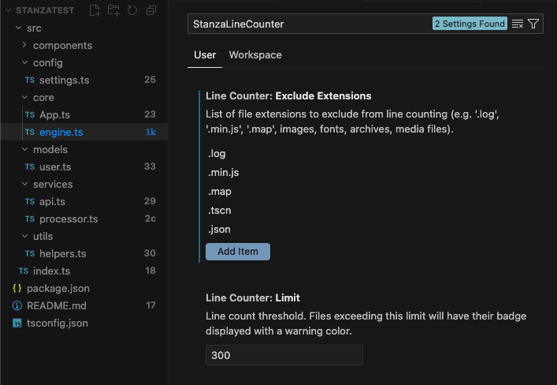

# StanzaLineCounter

[](https://marketplace.visualstudio.com/items?itemName=Psychobarge.stanza-line-counter)
[](https://github.com/psychobarge/StanzaLineCounter/actions/workflows/tests.yml)
[](https://www.typescriptlang.org/)
[](https://opensource.org/licenses/MIT)
[](CHANGELOG.md)

VS Code / Cursor extension that displays the line count of each file directly in the Explorer panel.



## Features

- **Line count badges** — Each file shows a compact line count badge next to its name.
- **Ignore files/folders** — Easily exclude files or folders directly from the Explorer via right-click > **Stanza: Ignore this file/folder**.
- **Threshold alert** — Files exceeding the configured limit are highlighted with a customizable color.
- **Excluded extensions** — Skip files with specific extensions (logs, minified files, maps, images, fonts, archives, media files by default).
- **Excluded paths** — Skip entire directories or specific files by name/relative path.
- **Live refresh** — Badges update automatically on file save, creation, deletion, and configuration changes.

## Badge format

| Lines       | Badge | Example        |
|-------------|-------|----------------|
| 0–99        | As-is | `42`           |
| 100–999     | `Xc`  | `3c` (≈ 300)   |
| 1,000–9,999 | `Xk`  | `1k`           |
| 10,000+     | `∞`   | `∞`            |

The exact line count is always shown in the tooltip on hover.

## Requirements
Any IDE based on VS Code:
- [VS Code](https://code.visualstudio.com/) 
- [Cursor](https://cursor.sh/)
- [Antigravity](https://antigravity.google/) 
- [Windsurf](https://windsurf.com/editor)
- [Trae](https://www.trae.ai/)
- Others not tested but it should work on all VS Code based IDEs

## Installation

### From the marketplace

1. Open VS Code or Cursor.
2. Go to **Extensions** (Ctrl+Shift+X / Cmd+Shift+X).
3. Search for **StanzaLineCounter**.
4. Click **Install**.

### Via VSIX if you cannot see the extension

If the extension does not appear in the marketplace, install it from a VSIX file:

1. **Generate the VSIX** (from the project root):
   ```bash
   npm install
   npm run compile
   npx vsce package
   ```
   This creates a file like `stanza-line-counter-0.2.0.vsix`.

2. **Install the VSIX** :
   - Open the Command Palette (Ctrl+Shift+P / Cmd+Shift+P).
   - Run **Extensions: Install from VSIX...**.
   - Select the generated `.vsix` file.

## Configuration

| Setting                          | Type     | Default                       | Description                                                                 |
|----------------------------------|----------|-------------------------------|-----------------------------------------------------------------------------|
| `lineCounter.limit`              | number   | `300`                         | Line threshold — files above this show a warning badge.                     |
| `lineCounter.limitColor`         | string   | `editorInfo.foreground`      | The color used for files exceeding the limit (dropdown choice).      |
| `lineCounter.maxFileSizeMB`      | number   | `10`                          | Maximum file size in MB. Files larger than this will be ignored.            |
| `lineCounter.excludeExtensions`  | string[] | `[...]`                      | File extensions to exclude from counting. |
| `lineCounter.excludeFolders`     | string[] | `[...]`                      | Folder names, file names, or relative paths to exclude (e.g. `node_modules`, `src/gen.ts`). |

## Development

```bash
# Clone the repository
git clone https://github.com/psychobarge/StanzaLineCounter.git
cd StanzaLineCounter

# Install dependencies
npm install

# Compile
npm run compile   # or npm run watch for watch mode

# Run tests
npm test          # or npm run test:watch for watch mode
npm run test:coverage # for coverage report
```

To test the extension visually, press **F5** in VS Code / Cursor to launch the Extension Development Host.

## License

MIT © [psychobarge](https://github.com/psychobarge)
