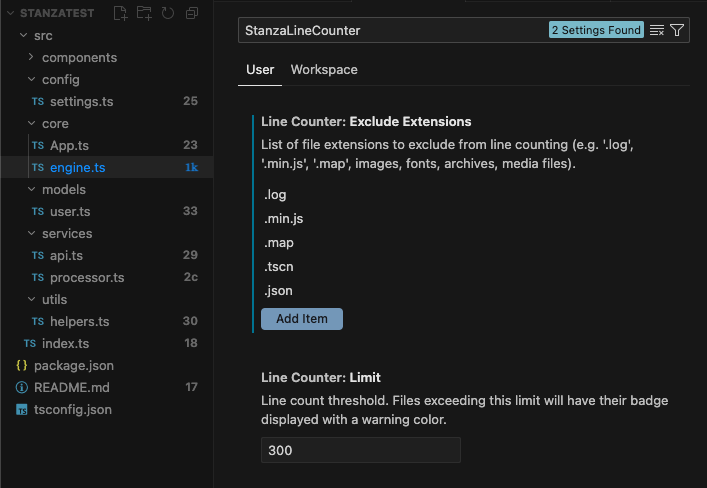
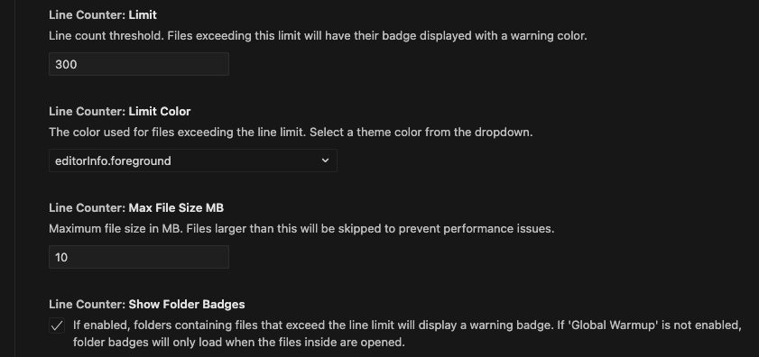

# StanzaLineCounter

VS Code / Cursor extension that displays the line count of each file directly in the Explorer panel.

## Disclaimer

This extension was developed with the assistance of an AI coding tool. That said, it was **not** vibe-coded — every feature, design decision, and line of code was deliberately thought through and reviewed by a human developer.

## Features

- **Line count badges** — Each file shows a compact line count badge next to its name.
- **Threshold alert** — Files exceeding the configured limit are highlighted with a customizable color.
- **Folder warning tags** — Folders containing files that exceed the line limit display a warning badge (⚠).
- **Customizable threshold** — Set your own line limit threshold per file extension.
- **Ignore extensions** — Customize which file extensions are excluded from line count calculations.
- **Ignore files/folders** — Customize which files or folders are excluded from line count calculations.
- **Easy exclusion** — Easily exclude extension, files or folders directly from the Explorer via right-click > 
   - **Stanza: Ignore this extension**
   - **Stanza: Ignore this file/folder**
- **Live refresh** — Badges update automatically on file changes or configuration updates.
- **Performance optimizations** — Streaming, caching, and background workspace scanning to ensure a smooth UI.

## Badge format

| Lines       | Badge | Example        |
|-------------|-------|----------------|
| 0–99        | As-is | `42`           |
| 100–999     | `Xc`  | `3c` (≈ 300)   |
| 1,000–9,999 | `Xk`  | `1k`           |
| 10,000+     | `∞`   | `∞`            |

The exact line count is always shown in the tooltip on hover.

## Requirements
Any IDE based on VS Code:
- [VS Code](https://code.visualstudio.com/) 
- [Cursor](https://cursor.sh/)
- [Antigravity](https://antigravity.google/) 
- [Windsurf](https://windsurf.com/editor)
- [Trae](https://www.trae.ai/)
- Others not tested but it should work on all VS Code based IDEs

## Installation

This extension is available on the VS Code Marketplace and Open VSX Marketplace.

## Configuration

| Setting                          | Type     | Default                       | Description                                                                 |
|----------------------------------|----------|-------------------------------|-----------------------------------------------------------------------------|
| `lineCounter.limit`              | number   | `300`                         | Line threshold — files above this show a warning badge.                     |
| `lineCounter.limitColor`         | string   | `editorInfo.foreground`      | The color used for files exceeding the limit.      |
| `lineCounter.maxFileSizeMB`      | number   | `10`                          | Maximum file size (MB) to ignore to preserve memory.            |
| `lineCounter.excludeExtensions`  | string[] | `[...]`                      | File extensions to exclude from counting. |
| `lineCounter.excludeFolders`     | string[] | `[...]`                      | Folders or specific paths to exclude (e.g. `node_modules`, `src/gen.ts`). |
| `lineCounter.useSmileys`          | boolean  | `false`                       | Use emojis instead of numbers (😎 below 90%, 😬 near limit, 😡 exceeded).                      |
| `lineCounter.showFolderBadges`    | boolean  | `true`                        | Display warning tags on folders containing exceeded files. |
| `lineCounter.enableWorkspaceWarmUp` | boolean  | `false`                       | Background scan at startup to find exceeded files in the entire workspace. (Recommended for large projects with folder badges enabled) |

## Performance

StanzaLineCounter is designed to be lightweight even on large projects:
- **Streaming**: For local files, we use Node streams to count lines without loading the whole file into RAM.
- **Intelligent Caching**: Results are cached and only re-calculated if the file modification time changes.
- **Non-blocking Warmup**: The workspace scan runs in chunks and yields to the event loop, ensuring your IDE remains responsive.
- **Path-based lookups**: Folder badges are calculated from a flat list of known exceeded files, avoiding expensive recursion during Explorer renders.

## License

MIT © [psychobarge](https://github.com/psychobarge)
